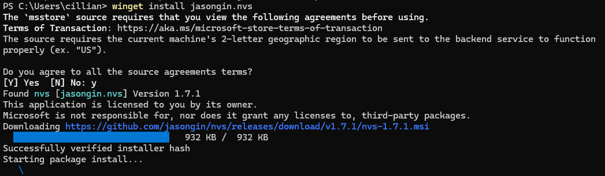

## Installing Node.js on macOS and Linux

GitHub: nvm-sh/nvm

### 1. Install Node.js using nvm
   
```bash
curl -o- htt‌ps://raw.githubusercontent.com/nvm-sh/nvm/v0.40.0/install.sh | bash
```

```bash
nvm install 20
```

verify that Node is installed:
```bash
node -v
```


### 2. Install Node.js using nvs
```bash
https://github.com/jasongin/nvs
```

